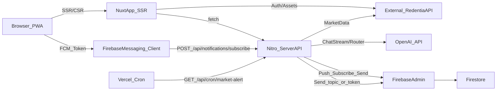
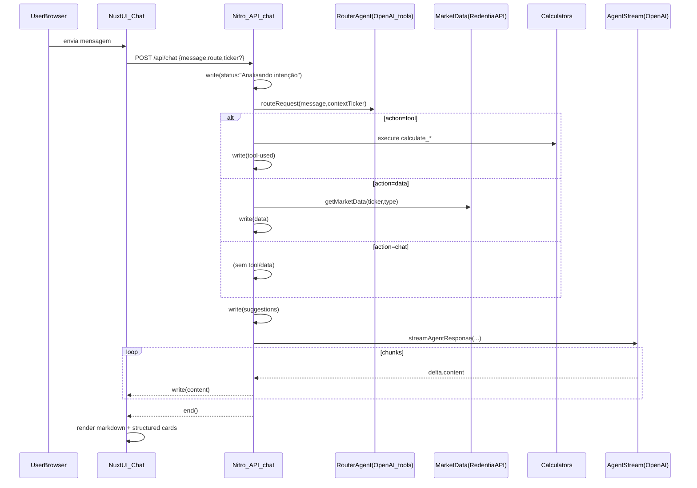
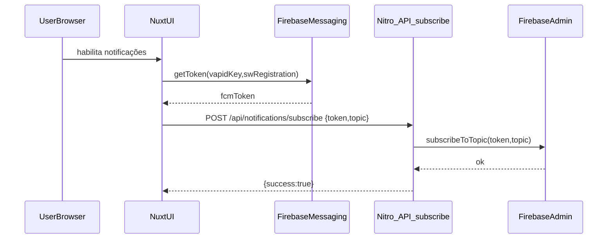

# Redentia — System Design (v1)

Este documento descreve **a arquitetura atual** do projeto e uma **arquitetura alvo (produção)**. Ele é a referência para decisões de produto/engenharia (frontend, APIs, IA, push notifications, deploy e operação).

## 1) Visão geral

### Objetivo do produto
Plataforma web (Nuxt SSR + PWA) para acompanhar mercado (ações/FIIs/BDRs/ETFs), fazer simulações e conversar com uma **IA de assessoria**. Há suporte a **push notifications** (FCM) e **alertas de mercado** via cron.

### Principais capacidades
- **Market data**: detalhes do ativo, preços históricos, dividendos, fundamentais (via Redentia API externa).
- **IA (chat)**: roteamento de intenção + execução de “tools” (calculadoras) + streaming de resposta.
- **Calculadoras**: juros compostos, planejamento, rentabilidade histórica.
- **Notificações**: inscrição em tópico e disparo (token ou broadcast) + alerta automático diário.
- **PWA**: instalação e service worker para FCM.

## 2) Arquitetura (alto nível)

### Componentes
- **Nuxt App (SSR)**: UI + rotas + stores/composables.
- **Nitro server routes** (`server/api/*`): endpoints internos (/api/chat, /api/notifications/*, /api/calculate, cron).
- **Redentia API externa** (`https://redentia-api.saraivada.com/api/*`): autenticação e dados de mercado.
- **OpenAI**: roteador de intenção (tools) + geração/stream de resposta + geração de mensagens de alerta.
- **Firebase Cloud Messaging (client)**: obtém token FCM no navegador.
- **Firebase Admin (server)**: subscribe/send/broadcast + Firestore (histórico de alertas).
- **Vercel**: hospedagem + cron (via `vercel.json`).

### Diagrama de componentes

## 3) Frontend (Nuxt App)

### Organização
- `app/pages/*`: páginas SSR/CSR (rotas).
- `app/layouts/*`: layouts (ex.: `default`, `unauthenticated`, `static`).
- `app/components/*`: atoms/molecules/organisms (Nuxt UI + Tailwind).
- `app/stores/*`: Pinia stores (`auth`, `interface`).
- `app/services/*`: clientes do backend externo (Redentia API).
- `app/composables/*`: cross-cutting (authFetch, notify, firebase notifications, caching).

### Autenticação no frontend
- Token é persistido em cookie `auth:token`.
- `app/middleware/auth.global.ts` decide redirecionamentos:
  - rotas não públicas sem token → `/auth/login`
  - rotas `/auth/*` com token → `/`
  - com token, tenta `auth.fetchProfile()` se ainda não carregou `me`.

### Cache de requisições (cliente)
`app/composables/usePrevents.ts` cacheia respostas no `sessionStorage` por chave/TTL (`runtimeConfig.public.cacheTempInSeconds`).

### PWA + notificações (cliente)
- O cliente obtém token via Firebase Messaging e chama `/api/notifications/subscribe`.
- Service worker atual: `public/firebase-messaging-sw.js` usa `firebase-messaging-compat` (FCM em background).

## 4) Backend (Nitro server routes)

### Endpoints principais
- **Chat (stream)**: `POST /api/chat` (`server/api/chat.post.ts`)
  - protocolo: **NDJSON** (JSON por linha, stream).
- **Calculadora**: `POST /api/calculate` (`server/api/calculate.post.ts`)
- **Notificações**:
  - `POST /api/notifications/subscribe`
  - `POST /api/notifications/send` (token)
  - `POST /api/notifications/broadcast` (topic)
  - `POST /api/notifications/market-alert` (manual/teste)
- **Cron**:
  - `GET /api/cron/market-alert` (Vercel cron, 17:00 seg–sex)
- **Sitemap**:
  - `GET /api/__sitemap__/urls`

## 5) Chat + IA (detalhamento)

### Visão geral do fluxo
1. UI (chat) envia `POST /api/chat` com `{ message, route, ticker? }`.
2. Server executa **roteamento de intenção** (`server/utils/router.ts`) com tools (function calling).
3. Se tool: calcula (juros/planning/retorno histórico) via `server/utils/calculators.ts`.
4. Se view de dados: busca market data via `server/utils/market.ts` (Redentia API externa).
5. Server streama resposta da IA via `server/utils/agent.ts` (OpenAI stream).
6. UI lê `ReadableStream` e aplica eventos (status, data, suggestions, tool-used, related-tickers, content, error).

### Contrato de streaming (NDJSON)
Eventos do stream (cada linha é um JSON):
- `status`: mensagens curtas de progresso
- `data`: payload estruturado (ex.: price/chart/dividends/report)
- `tool-used`: resultado de simulação
- `suggestions`: sugestões de prompts
- `related-tickers`: tickers citados na resposta
- `content`: texto incremental (markdown)
- `error`: erro de execução

### Diagrama de sequência (chat)

### Arquitetura alvo (produção) para chat
Recomendado:
- Responder `Content-Type: application/x-ndjson` e `Cache-Control: no-store`.
- Rate limit (por IP/cookie) em `/api/chat`.
- Telemetria (latência, tokens, erros) + tracing.
- Guardrails: validação de input, limite de tamanho do prompt, timeouts, fallback.

## 6) Market data

### Fonte de dados
Hoje, **todo market data vem da Redentia API externa**.
No server (`server/utils/market.ts`), o BFF normaliza shapes variados para:
- `price`
- `chart`
- `dividends`
- `analysis`
- `report` (agregado em paralelo)

### Arquitetura alvo (produção)
- Cache server-side por ticker+tipo+período (Nitro storage/redis) com TTL curto.
- Circuit breaker (timeouts) e fallback de resposta.

## 7) Calculadoras

### Onde ficam
`server/utils/calculators.ts` implementa:
- `calculateCompoundInterest`
- `calculateStockReturn` (usa `getMarketData(..., 'chart'|'dividends')`)
- `calculatePlanning` (estratégias fixas + simulação histórica)

### Arquitetura alvo (produção)
- Garantir validação/sanitização de inputs.
- Cache de históricos para simulações (evitar refetch do “full” sempre).
- Limitar custo de simulações (amostragem/timeouts).

## 8) Notificações + Alertas de Mercado

### Subscription (client → server)
1. Cliente obtém token FCM com SW pronto.
2. Envia `{ token, topic }` para `/api/notifications/subscribe`.
3. Server usa Firebase Admin para `subscribeToTopic`.

### Alertas automáticos (cron)
`vercel.json` agenda `/api/cron/market-alert`.
`server/utils/marketAlert.ts`:
- busca top movers (gainers/losers)
- filtra por thresholds e histórico do dia (Firestore)
- gera mensagem curta via OpenAI
- envia para token (manual) ou tópico `market_alerts`
- registra ticker alertado no Firestore (anti-spam diário)

### Arquitetura alvo (produção)
- Proteger cron com segredo (header/secret env).
- Separar “seleção de candidato” de “geração de mensagem” (observabilidade + testes).
- Limitar custo OpenAI (máx 1 alerta/dia, fallback sem IA).

## 9) Segurança e privacidade

### Segredos e variáveis
- **Server-only**:
  - `NUXT_OPENAI_API_KEY`
  - `FIREBASE_CLIENT_EMAIL`
  - `FIREBASE_PRIVATE_KEY`
- **Public** (ok expor):
  - `NUXT_PUBLIC_FIREBASE_*` (config client)
  - `NUXT_PUBLIC_SITE_URL`

### Riscos e mitigação (alvo)
- **Abuso de /api/chat** → rate limit + captcha opcional + quotas.
- **Notificações**: validar `topic` contra allowlist.
- **Cron**: exigir secret.
- **Logs**: nunca logar tokens, headers Authorization, ou payloads sensíveis.

## 10) Deploy e operação

### Hospedagem
Vercel (SSR + serverless). Cron configurado em `vercel.json`.

### Observabilidade (alvo)
- Logs estruturados (requestId, route, latency).
- Monitoramento de erros (Sentry ou similar) em client/server.
- Métricas: p95/p99 latency `/api/chat`, erros OpenAI/Firebase/Redentia API.

## 11) Roadmap técnico (alvo)

### Fase 1 — Hardening (1–2 sprints)
- Headers/NDJSON e timeouts no `/api/chat`.
- Rate limiting + validação de input.
- Proteger cron com secret.
- Cache server-side para market data (TTL curto).

### Fase 2 — Observabilidade e custos (1 sprint)
- Sentry + dashboards.
- Telemetria de tokens/custos do OpenAI.
- Auditoria de logs.

### Fase 3 — Evolução de arquitetura (2+ sprints)
- Client unificado para Redentia API (tipado) + retries.
- BFF mais consistente (contratos, versionamento).
- Jobs/queues para tarefas pesadas (alertas/relatórios).

